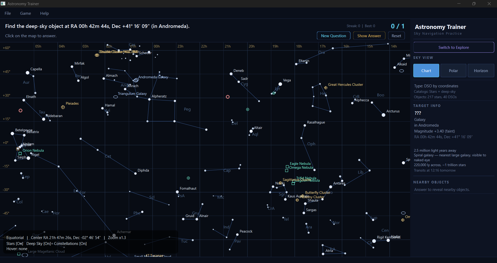
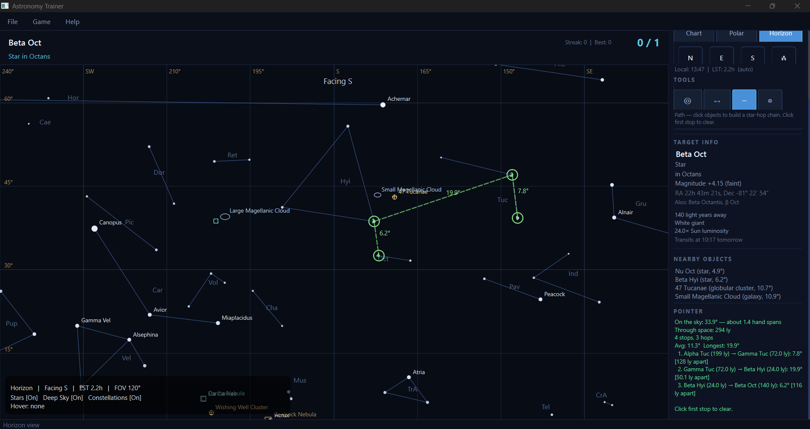
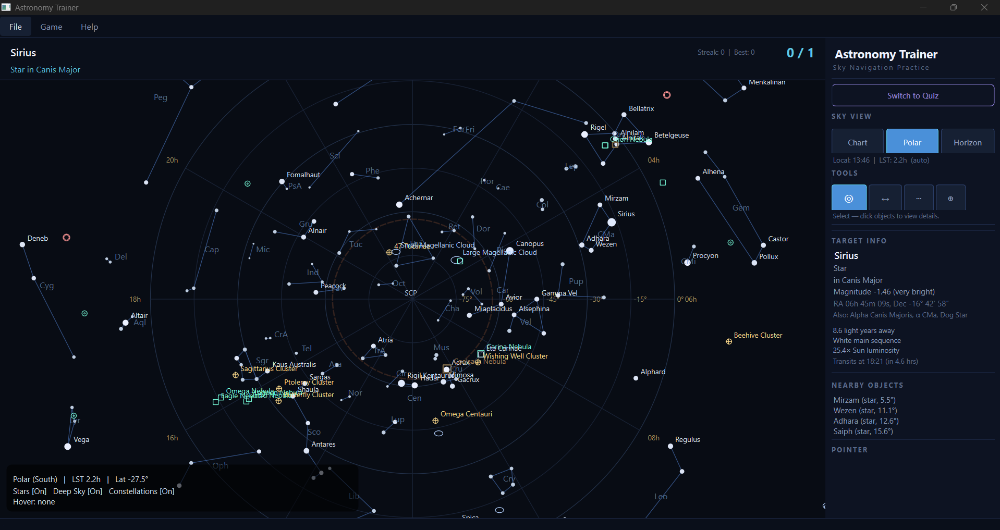
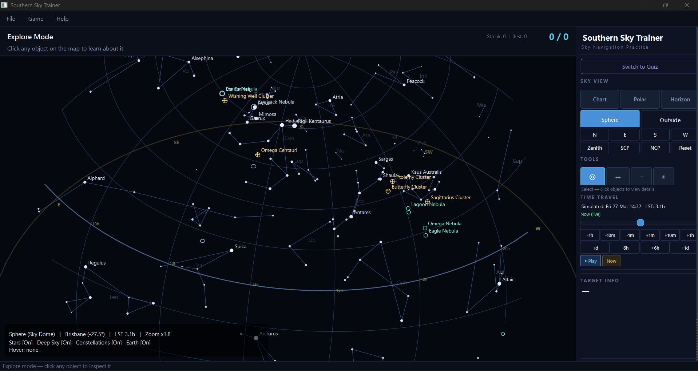
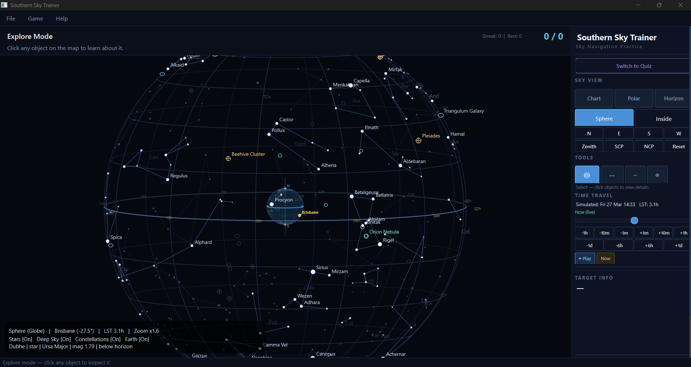
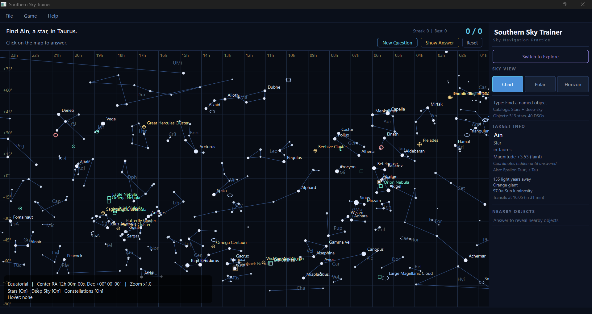

# Southern Sky Trainer

An interactive desktop application for learning to navigate the night sky. Built for southern hemisphere observers, with a particular focus on the Australian sky.



Southern Sky Trainer teaches sky navigation through direct interaction rather than passive reference. A quiz system with spaced repetition asks you to locate stars, deep-sky objects, and constellations across multiple sky projections. Explore mode provides measurement tools for angular distances, star-hopping chains, and coordinate identification. A time scrubber lets you wind the sky forward or backward to watch stars rise and set. A 3D celestial sphere model shows how the coordinate system wraps around Earth. Every object in the catalogue carries physical data — distance, spectral type, luminosity — turning abstract dots into real objects at real distances in three-dimensional space.

---

## Table of Contents

- [Installation](#installation)
- [Quick Start](#quick-start)
- [Sky Views](#sky-views)
- [Quiz Mode](#quiz-mode)
- [Explore Mode and Tools](#explore-mode-and-tools)
- [Time Travel](#time-travel)
- [Star Catalogue](#star-catalogue)
- [Controls Reference](#controls-reference)
- [Project Structure](#project-structure)
- [Extending the Catalogue](#extending-the-catalogue)
- [Technical Details](#technical-details)
- [Licence](#licence)

---

## Installation

### Prerequisites

- Python 3.10 or later
- pip (Python package manager)
- A display resolution of 1366×768 or higher is recommended

### Setup

Clone the repository:

```bash
git clone https://github.com/M1ck4/southern-sky-trainer.git
cd southern-sky-trainer
```

Install the required dependency:

```bash
pip install -r requirements.txt
```

The only dependency is `PySide6>=6.6` (Qt for Python). No internet connection, accounts, API keys, or telemetry are involved at any point.

### Verify Installation

```bash
python main.py
```

The application window should open maximised with the chart view loaded and a quiz question displayed. If PySide6 is not installed, you will see an `ImportError` — run the pip install step above.

### Platform Notes

The application has been developed and tested on Windows 10/11 with Python 3.12. It should work on macOS and Linux with PySide6 support, though the timezone auto-detection and window geometry may behave slightly differently across platforms.

---

## Quick Start

1. Launch the application with `python main.py`
2. The chart view opens with a quiz question in the top bar — something like "Find Sirius, a star in Canis Major"
3. Click on the star map to answer. Green ring means correct, red ring means wrong
4. Use the scroll wheel to zoom, drag to pan, double-click to centre on an object
5. Switch to **Explore** mode using the button in the side panel to browse freely
6. Switch between **Chart**, **Polar**, **Horizon**, and **Sphere** views using the sky view buttons
7. In horizon view, press **S** (south) to face the Southern Cross, or **N** to see the northern sky
8. Use the **Time Travel** scrubber in explore mode to wind the sky forward or backward and watch stars rise and set

---

## Sky Views

### Chart (Equatorial Projection)

The default view. A flat rectangular projection of the entire sky using Right Ascension (horizontal) and Declination (vertical) as axes.

- RA increases right to left (matching the astronomical convention for sky charts)
- Horizontal scrolling wraps seamlessly — the sky is continuous
- Vertical scrolling extends 30° past each pole for comfortable viewing of polar objects
- Zoom from 1× to 25× with the scroll wheel or +/− keys
- Adaptive sub-grid lines appear as you zoom in — 30-minute RA intervals and 5° Dec intervals at moderate zoom, tightening to 15-minute RA and 2° Dec at high zoom
- Grid labels in warm amber, constellation lines in blue, coordinate axes clearly separated

This is the study view for learning the RA/Dec coordinate system and understanding how constellations relate to each other across the full sky. The time scrubber is not available in this view since the chart shows fixed celestial coordinates.

### Horizon (Local Sky)



A real-time view of the sky from your detected location, as it appears right now. The horizon sits at the bottom with altitude lines above. Compass directions are labelled along the top.

- Face any compass direction using the N/E/S/W buttons or by dragging
- Objects below the horizon fade into a darkened ground overlay
- Field of view adjustable from 30° (telescope-like) to 180° (full hemisphere)
- Adaptive sub-grid lines appear at higher zoom levels
- Updates every 30 seconds to track Earth's rotation
- Southern hemisphere orientation — Orion appears "upside down" compared to northern hemisphere charts, exactly as it looks from Australia

This is the view you hold up against the real sky outside. Face south, and the Southern Cross sits where it should. Face north-east, and Orion hangs above the horizon as it does on a March evening from Queensland.

### Polar (Planisphere)



A south-centred stereographic projection, rotated to the current Local Sidereal Time.

- Declination rings show distance from the south celestial pole
- Hour angle spokes radiate outward with RA labels
- A dashed circle marks the horizon for the observer's latitude
- The SCP (South Celestial Pole) is marked at the centre
- Stars that never rise from your latitude are filtered out
- Adaptive sub-grid detail increases with zoom
- Zoom and pan supported

This view shows everything above the horizon at once. It is particularly useful for planning observing sessions and understanding which constellations are circumpolar from your latitude.

### Celestial Sphere (3D Globe and Sky Dome)





A 3D model of the celestial sphere with two viewing modes, toggled with the Inside/Outside button or the I key.

**Outside (Globe)** — View the celestial sphere as a glass globe with Earth at the centre. Drag to rotate the globe. Stars are positioned using Hour Angle coordinates so that stars directly above the observer marker on Earth are the same stars overhead in the real sky at the current time. When you scrub time forward, stars drift westward across the globe while Earth stays fixed. The Earth shows:

- Latitude and longitude grid lines
- Equator highlighted in blue, tropics and arctic circles in dashed lines
- Greenwich meridian in green
- North and south pole markers
- Continent reference labels (EU, NA, SA, AF, AU, AS, JP, AN)
- Your detected location marked with a yellow dot and city name
- NCP and SCP labels on the celestial sphere

**Inside (Sky Dome)** — Stand at the centre of the sphere looking outward. The sky fills the viewport as a fisheye dome projection. Star positions are computed using the full altitude/azimuth transformation for your latitude and the current sidereal time, guaranteeing accurate positions. The horizon circle, compass directions, and zenith are marked. Drag to look around. This view shows exactly what you would see if you stood outside and looked up — stars rise in the east, arc across the sky, and set in the west as you scrub time.

**Navigation buttons** appear in the side panel when the sphere view is active:

- **Your Sky** — jump to the default orientation
- **N / E / S / W** — face a compass direction
- **Zenith** — look straight up
- **SCP / NCP** — look at the celestial poles

Distance, path, and identify tools are disabled in sphere mode as they do not render well on a 3D surface. The select tool works normally for clicking objects.

### Cursor Crosshair (Explore Mode)

In explore mode, a subtle crosshair follows the mouse cursor across the chart, polar, and horizon views. A tooltip near the cursor shows the exact RA/Dec (or Alt/Az in horizon view) of the current position. The overlay info panel at the bottom also shows a persistent cursor coordinate readout. This lets you check your coordinate estimates by hovering — guess where 6h 30m RA is, then verify by moving the mouse there.

The crosshair is not shown in quiz mode to avoid giving away answers. Toggle with the 5 key.

---

## Quiz Mode



The quiz system tests your ability to locate objects on the sky map. Questions appear in the top bar with score and streak tracking.

### Question Types

| Mode | Example |
|------|---------|
| Find by name | "Find Sirius, a star in Canis Major" |
| Find by coordinates | "Find the star at RA 06h 45m 09s, Dec −16° 42' 58" (in Canis Major)" |
| Find a named DSO | "Find the Orion Nebula, a nebula in Orion" |
| Find a DSO by coordinates | "Find the object at RA 05h 35m 17s, Dec −05° 23' 28" (in Orion)" |
| Find any object | "Find Alphard, a star in Hydra" |
| Find by alias | "Find M42" |
| Find in constellation | "Find any object in Scorpius" |
| Find any by coordinates | Combined star and DSO coordinate questions |

### Spaced Repetition

Objects you answer incorrectly are tracked and revisited more frequently. The system gives a 40% chance of re-asking a previously missed object, weighted by how many times you have missed it. The last 12 objects are excluded from selection to prevent immediate repetition.

### Spoiler Prevention

The target info panel adapts to the question type. For name-based questions, coordinates are hidden until you answer. For coordinate-based questions, the name and aliases are hidden. After answering, all details are revealed along with the four nearest catalogue objects and their angular distances.

---

## Explore Mode and Tools

Switch to Explore mode with the side panel button or Ctrl+E. Four tools are available via icon buttons:

### ◎ Select

Click any object to view its complete details in the side panel:

- Name, type, constellation, and magnitude with brightness description
- RA/Dec coordinates
- Known aliases (e.g. "Alpha Canis Majoris, α CMa")
- Distance from Earth in light years
- Spectral type and human-readable colour description
- Luminosity relative to the Sun
- Live transit time — when the object crosses the meridian (highest point in the sky)
- The four nearest catalogue objects with angular distances

### ↔ Distance

Click two objects to measure the angular separation between them.

The side panel displays:
- Angular distance in degrees
- Hand-at-arm's-length analogy (pinky width, fist width, hand span)
- Compass direction (e.g. "north and east")
- RA and Dec differences
- Binocular field-of-view equivalence ("fits in a binocular field")

A dashed gold line is drawn between the two objects on the map with the distance labelled at the midpoint. Click the anchor object again to clear the measurement. Not available in sphere view.

### ⋯ Path

Build a star-hopping chain by clicking objects in sequence. The map draws numbered green nodes with dashed connecting lines.

The side panel shows:
- Total angular path across the sky
- Total 3D distance through space in light years
- Per-leg breakdown with distance from Earth for each stop
- Average and longest leg distances
- Hand measurement analogy for the total path

Click the last stop to undo it. Click the first stop to clear the entire chain. Useful for planning routes like "Acrux → Mimosa → Hadar → Rigil Kentaurus" and understanding both the apparent and real distances involved. Not available in sphere view.

### ⊕ Identify

Click anywhere on the sky — including empty space with no object — to see:
- RA/Dec coordinates of the clicked position
- Nearest constellation
- Nearest star with angular distance
- Nearest deep-sky object with angular distance
- Count of catalogue objects within 5°
- The five nearest objects listed in the nearby panel

This is particularly useful for learning coordinates by pointing at random positions and checking what you are near. Not available in sphere view.

---

## Time Travel


The Time Travel panel appears in the side panel when in explore mode and viewing a time-dependent projection (polar, horizon, or sphere). It is not shown in chart mode since the chart displays fixed RA/Dec coordinates.

### Controls

- **Time slider** — drag to scrub ±12 hours from the current time. The sky updates live as you drag.
- **Fine step buttons** — ±1 minute, ±10 minutes, ±1 hour for precise adjustments
- **Coarse step buttons** — ±6 hours, ±1 day for jumping through a full night or across days
- **Play** — animates time forward at approximately 1 hour of sky rotation per second. Press again to pause.
- **Now** — resets to live real-time mode

### Display

The panel shows the simulated date/time (e.g. "Wed 26 Mar 22:45"), the current Local Sidereal Time, and the offset from real time (e.g. "+3.5 hrs" in gold, or "Now (live)" in green when at real time).

### How It Works

The scrubber computes the Julian Date for the offset time and derives the corresponding Local Sidereal Time using the standard IAU formulae. This LST is then pushed to the active sky widget, which recomputes all star positions accordingly. In the horizon and sphere inside views, each star's altitude and azimuth are recalculated using the full spherical trigonometry transformation, guaranteeing that star positions match what the observer would actually see at the simulated time.

Educationally, this is one of the most powerful features: watching Orion rise in the east, cross the meridian, and set in the west makes the relationship between RA/Dec and the local sky visceral rather than abstract. Scrubbing a full day shows how the sky shifts by about 1° due to Earth's orbital motion. Scrubbing months reveals seasonal constellations appearing and disappearing.

When you switch back to quiz mode, the time automatically resets to live.

---

## Star Catalogue

### Stars

313 named stars across 65 constellations. Every star includes:

| Field | Description | Range |
|-------|-------------|-------|
| Distance | Light years from Earth | 4.4 ly (Rigil Kentaurus) to 11,650 ly (Rho Cassiopeiae) |
| Spectral type | MK classification | O9.5 through M7 |
| Colour description | Human-readable | "Blue supergiant", "Red giant", "Yellow main sequence (Sun-like)" |
| Luminosity | Relative to the Sun | 0.44× (Mu Cassiopeiae) to 813,000× (Naos) |

The catalogue has strong southern hemisphere coverage: Crux (5-star cross), Centaurus (9 stars), Scorpius (15 stars with full scorpion figure), Carina, Vela, Puppis, Tucana, Hydrus, Octans, Dorado, Musca, Chamaeleon, and many more.

25 constellations have fully-drawn stick figures with enough stars to make the patterns recognisable and learnable.

### Deep-Sky Objects

40 objects including emission nebulae, planetary nebulae, supernova remnants, dark nebulae, globular clusters, open clusters, and galaxies. Each with distance, structural type, description, and physical notes (size, star count).

Objects range from the Coalsack Nebula at 600 light years to the Sombrero Galaxy at 31 million light years. Rendered with distinct symbols: ellipses for galaxies, crosshairs for clusters, nested circles for planetary nebulae, squares for dark nebulae.

---

## Controls Reference

### Mouse

| Action | Chart | Horizon | Polar | Sphere |
|--------|-------|---------|-------|--------|
| Scroll wheel | Zoom in/out | Adjust field of view | Zoom in/out | Zoom in/out |
| Left-click drag | Pan RA/Dec | Look around | Pan chart | Rotate sphere/gaze |
| Left click on object | Select or answer | Select or answer | Select or answer | Select or answer |
| Double-click | Centre on object | Snap facing | Centre on object | Centre on object |
| Middle/right drag | Pan | Pan | Pan | Rotate |

### Keyboard

| Key | Function |
|-----|----------|
| Arrow keys | Pan (chart), rotate facing (horizon), rotate sphere (sphere) |
| + / − | Zoom in/out (all views) |
| R | Reset view to defaults |
| I | Toggle inside/outside (sphere view) |
| 1 | Toggle star visibility |
| 2 | Toggle deep-sky object visibility |
| 3 | Toggle constellation line visibility |
| 4 | Toggle sub-grid lines (chart, polar, horizon) |
| 5 | Toggle cursor crosshair (explore mode) |
| Ctrl+E | Toggle between Quiz and Explore mode |
| Ctrl+N | Load a new quiz question |
| Ctrl+A | Reveal the answer |

### Side Panel

- **Switch to Quiz / Explore** — mode toggle
- **Chart / Polar / Horizon** — flat projection views
- **Sphere** — 3D celestial sphere view
- **Inside / Outside** — sphere viewing mode (sphere view only)
- **Your Sky / N / E / S / W / Zenith / SCP / NCP** — sphere navigation (sphere view only)
- **N / E / S / W** — facing direction (horizon view only)
- **◎ ↔ ⋯ ⊕** — explore tool selection (explore mode only, ↔ ⋯ ⊕ disabled in sphere)
- **Time Travel** — time scrubber with slider, step buttons, play/pause, and reset (explore mode, non-chart views)
- **New Question / Show Answer / Reset** — quiz controls (quiz mode only)

---

## Project Structure

```
southern-sky-trainer/
├── main.py                  Application entry point
├── app_window.py            Main window, side panel, action bar, quiz and explore UI
├── star_map.py              Interactive map widget with three projections and rendering
├── celestial_sphere.py      3D celestial sphere with globe and dome views
├── quiz_engine.py           Quiz logic with eight modes and spaced repetition
├── coordinates.py           Coordinate mathematics: JD, GMST, LST, alt/az, projections,
│                            timezone-based observer location detection
├── object_matcher.py        Answer matching by ID, name, angular proximity, constellation
├── catalog_loader.py        CSV and JSON loading with data normalisation
├── requirements.txt         Dependencies (PySide6 only)
├── README.md
├── LICENSE
├── data/
│   ├── stars.csv            313 stars with coordinates and physical properties
│   ├── deep_sky.csv         40 deep-sky objects with coordinates and descriptions
│   ├── constellation_lines.json    Line segment patterns for 63 constellations
│   └── constellations.json  Constellation metadata with abbreviations and label positions
└── doc/
    ├── screenshot.png       Chart view screenshot
    ├── path_view.png        Horizon view with path tool
    ├── polar_view.png       Polar planisphere view
    ├── quiz_mode.png        Quiz mode screenshot
    ├── sphere1.png          Sphere inside (sky dome) view
    └── sphere2.png          Sphere outside (globe) view
```

---

## Extending the Catalogue

The catalogue is entirely data-driven. All astronomical content lives in CSV and JSON files. No code changes are needed to add objects.

### Adding a Star

Append a row to `data/stars.csv`:

```csv
my_star,My Star,"Alpha Whatever; α Wha",120.5,-45.3,3.50,Centaurus,star,200,B8III,Blue-white giant,1500
```

The columns are: `id`, `name`, `aliases` (semicolon-separated), `ra_deg`, `dec_deg`, `magnitude`, `constellation`, `object_type`, `distance_ly`, `spectral_type`, `colour_desc`, `luminosity_solar`.

The star will appear on the map immediately. The quiz system will include it in questions.

### Adding Constellation Lines

Edit `data/constellation_lines.json`. Each constellation maps to a list of line segments, where each segment is a pair of star IDs:

```json
{
  "My Constellation": [
    ["star_id_1", "star_id_2"],
    ["star_id_2", "star_id_3"]
  ]
}
```

Star IDs must match the `id` column in `stars.csv`.

### Adding a Deep-Sky Object

Append a row to `data/deep_sky.csv` following the same column structure. Supported object types: `nebula`, `planetary_nebula`, `supernova_remnant`, `dark_nebula`, `globular_cluster`, `open_cluster`, `galaxy`, `star_system`.

Each deep-sky object can include `distance_ly`, `spectral_type`, `colour_desc`, and `notes` for physical descriptions.

---

## Technical Details

### Coordinate System

All positions are stored as RA/Dec in degrees. The application computes Julian Date, Greenwich Mean Sidereal Time, and Local Sidereal Time using standard IAU formulae. Equatorial-to-horizontal coordinate conversion provides the alt/az positions used by the horizon view and the sphere's inside (dome) projection. Stereographic projection is used for the polar planisphere. The celestial sphere's outside (globe) view uses Hour Angle coordinates (HA = LST − RA) to ensure stars are correctly positioned relative to the observer on Earth.

### Observer Location

The observer's location is auto-detected from the system timezone. The `detect_observer_location()` function in `coordinates.py` tries three approaches:

1. **IANA timezone name** — reads the system's timezone identifier (e.g. `Australia/Brisbane`) and maps it to coordinates via a lookup table of ~70 cities worldwide
2. **Timezone abbreviation** — falls back to common abbreviations like `AEST`, `PST`, `JST` mapped to representative cities
3. **UTC offset** — as a final fallback, maps the numeric UTC offset to a representative location

No network access or location services are required. The detection is accurate to city level, which is more than sufficient for astronomy. The detected city name appears on the Earth model in the sphere view and in the status overlay.

Default fallback: Brisbane, Queensland, Australia (latitude −27.47°, longitude 153.03°).

### Time

Polar, horizon, and sphere views refresh every 30 seconds via a QTimer. The Local Sidereal Time drives the sky rotation — stars drift naturally across the view just as they do in the real sky. Transit times for individual objects are computed live from the current LST.

The Time Travel scrubber computes an offset Julian Date and derives the corresponding LST, pushing it to all active sky widgets. The time offset is tracked as minutes from real time and can extend beyond the slider's ±12-hour range via step buttons. Animated playback advances at ~60 simulated minutes per real second at 20 frames per second.

### Celestial Sphere Projections

The sphere widget uses two fundamentally different projection methods:

- **Outside (globe)**: Stars are placed using Hour Angle and Declination in a 3D Cartesian frame, then projected via perspective projection. Earth points use the same HA/Dec frame with the observer's longitude mapped to HA=0, so the observer dot always sits on the meridian and stars above it are the same stars overhead in reality.

- **Inside (dome)**: Stars are converted to altitude/azimuth using the full `ra_dec_to_alt_az()` spherical trigonometry transform, then projected via equal-angle fisheye mapping. This guarantees star positions match what the observer would actually see, including correct rising/setting angles for their latitude.

Rotation state is maintained separately for each mode, so switching between inside and outside remembers your orientation in each.

### Adaptive Grid

The chart, polar, and horizon views use an adaptive sub-grid system. At zoom level 1× only the primary grid is shown (1h RA / 15° Dec intervals). As the user zooms in, finer grid lines appear:

| Zoom Level | Dec Interval | RA Interval |
|------------|-------------|-------------|
| < 1.5× | Primary only (15°) | Primary only (1h) |
| 1.5–3× | 5° | 30 min |
| 3–6× | 5° | 15 min |
| 6–12× | 2° | 15 min |
| 12×+ | 1° | 7.5 min |

Sub-grid lines are drawn as thin dashed lines in a dimmer colour, with labels that integrate seamlessly into the primary grid labels to avoid overlap.

### Rendering

Stars are sized by magnitude (brighter stars appear larger). Deep-sky objects use distinct symbols by type. Three visual layers are kept distinct: warm amber coordinate labels, blue constellation lines, and dim grid lines. The horizon view includes a gradient ground overlay below the horizon line with a subtle warm glow at the boundary.

### Dependencies

`PySide6>=6.6` — the Qt for Python framework. No other dependencies. No numpy, no astropy, no internet access. All coordinate mathematics is implemented from first principles in `coordinates.py`.

---

## Licence

MIT. See [LICENSE](LICENSE) for details.

---

Built in Queensland, shared in the spirit of looking up.
